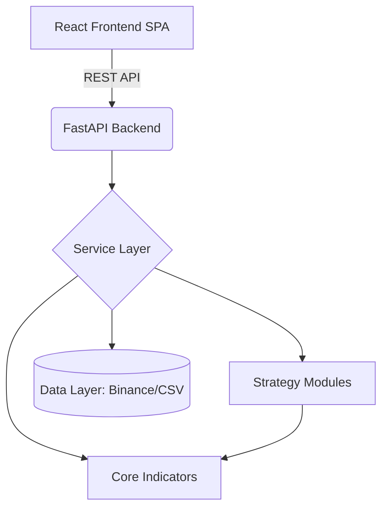

# System Architecture: Quant-Lab

> **Implementation PM Perspective:**
> This document outlines the canonical structure of the Quant-Lab platform. The architecture was designed to solve three core problems in quantitative software: **Data Integrity, Logic Reusability, and Scalable Presentation.** By enforcing strict boundaries between data fetching, mathematical computation, and HTTP routing, we ensure that the system remains robust as new strategies are introduced.

## 🏗️ High-Level Architecture

The system follows a modern, decoupled client-server architecture.

## 📂 Directory Structure & Responsibility

### 1. Backend (Python / FastAPI)
The backend is structured using Domain-Driven Design (DDD) principles to prevent "spaghetti code" as the number of trading strategies grows.

*   **`backend/modules/` (The API Layer):**
    *   *Responsibility:* HTTP routing, request validation (Pydantic), and response formatting.
    *   *Rule:* **No business logic here.** Routers only orchestrate calls to the Service layer.
*   **`backend/services/` (The Orchestration Layer):**
    *   *Responsibility:* Coordinates between data fetching, strategy execution, and caching.
*   **`backend/strategy/` (The Business Logic Layer):**
    *   *Responsibility:* Contains the specific rules for trading strategies (e.g., `streak`, `hybrid`, `bb_mid`).
    *   *Design Choice:* Strategies are isolated. The `streak` module does not know about the `hybrid` module.
*   **`core/` (The Pure Math Layer):**
    *   *Responsibility:* Stateless calculation of financial indicators (RSI, MACD, ATR) and core backtesting loops.
    *   *Design Choice:* Functions here take Pandas DataFrames and return DataFrames. They have zero knowledge of APIs or HTTP requests.

### 2. Frontend (React / TypeScript)
The frontend uses a Feature-Sliced Design (FSD) approach to manage complexity.

*   **`src/features/`:** Contains domain-specific logic and components (e.g., `streak-analysis`, `ai-lab`). This prevents the `components/` folder from becoming a dumping ground.
*   **`src/api/`:** Centralized Axios clients. Components never make direct `fetch` calls.
*   **`src/store/`:** Zustand is used for global state (like the currently selected Coin and Timeframe) to ensure the UI remains synchronized across different analysis views.

## 🔄 Data Flow Example: AI Quant Lab

To demonstrate the architecture in action, here is the flow when a user asks the AI to analyze a condition:

1.  **User Input:** "Probability that the next candle is bullish when RSI < 30" (Frontend `ChatInterface.tsx`)
2.  **API Call:** POST `/api/ai/research` (Frontend `api/ai_lab.ts`)
3.  **Routing:** `backend/modules/ai_lab/router.py` receives the request.
4.  **Service & LLM:** `service.py` sends the prompt to the LLM Gateway to parse the natural language into a structured JSON condition.
5.  **Parsing:** `parser.py` converts the JSON into executable Pandas boolean masks.
6.  **Data Fetching:** The system retrieves the required OHLCV data (cached if available).
7.  **Calculation:** `core/indicators.py` calculates the RSI.
8.  **Analysis:** `analyzer.py` applies the mask, calculates the Wilson Confidence Interval and p-value.
9.  **Response:** The structured data is returned to the frontend and rendered via Plotly charts.

## 🛡️ Quality Assurance & Testing

As a PM, ensuring reliability in financial software is paramount.
*   **Unit Testing:** `pytest` is used extensively in the backend (`backend/tests/`), currently maintaining a baseline of 118 passing tests covering core math and API endpoints.
*   **Type Safety:** Strict TypeScript on the frontend and Pydantic models on the backend ensure data contracts are honored.
*   **Error Handling:** Centralized decorators (`utils/decorators.py`) catch and format exceptions before they reach the client.
