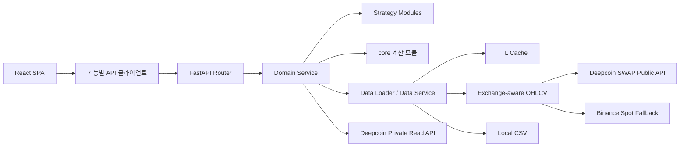

# Quant-Lab Architecture

이 문서는 2026-08-21 기준의 현재 구조와 의존성 방향을 설명합니다. Quant-Lab은 개인용 암호화폐 분석 도구지만, 데이터 접근·계산·HTTP·UI를 분리해 기능 추가 시 변경 범위를 좁히는 구조를 유지합니다.

## 전체 흐름

```mermaid
flowchart LR
    UI[React SPA] --> API[기능별 API 클라이언트]
    API --> R[FastAPI Router]
    R --> S[Domain Service]
    S --> ST[Strategy Modules]
    S --> C[core 계산 모듈]
    S --> D[Data Loader / Data Service]
    D --> CACHE[TTL Cache]
    D --> EXCHANGE[Exchange-aware OHLCV]
    EXCHANGE --> DEEPCOIN_PUBLIC[Deepcoin SWAP Public API]
    EXCHANGE --> BINANCE[Binance Spot Fallback]
    D --> CSV[Local CSV]
    S --> DEEPCOIN[Deepcoin Private Read API]
```

의존성의 기본 방향은 `frontend -> backend/modules -> backend/strategy 또는 core -> backend/utils`입니다. `core/`는 HTTP, 파일 I/O, 네트워크 접근을 하지 않습니다. 라우터도 전략 로직을 직접 호출하지 않고 도메인 서비스를 거칩니다.

## 디렉터리 책임

### `frontend/`

React 18, TypeScript, Vite, Tailwind 기반 SPA입니다.

- `src/App.tsx`: 10개 활성 경로와 `/`의 추세판단 리다이렉트
- `src/pages/`: 화면별 조립과 화면 상태
- `src/features/`: AI Lab, 연속봉 분석, 복리 계산기의 기능 단위 구성요소
- `src/components/`: 차트, 사이드바, 지표 패널 등 공유 UI
- `src/hooks/useTrendPriceChart.ts`: 추세판단과 전용 차트가 공유하는 VPVR·가격 투영·OHLCV 조회
- `src/hooks/useHourlyRefresh.ts`: 추세 화면의 정각 갱신과 장시간 비활성 탭 복귀 갱신
- `src/api/`: Axios 인스턴스와 기능별 API 호출. 컴포넌트에서 직접 HTTP 호출하지 않음
- `src/types/`: 프런트엔드 계약 타입
- `src/store/`: Zustand의 선택 코인·시간대·언어·사이드바 상태
- `src/utils/ohlcv.ts`: OHLCV 정규화와 진행 중 봉 제외 공통 처리
- `src/utils/holdReentry.ts`: 홀딩과 재진입 시나리오의 순수 손익·추가 수수료 계산

등록 경로는 `/journal`, `/trade-analysis`, `/trend-judgment`, `/trend-chart`, `/streak-analysis`, `/compound-calculator`, `/hold-reentry`, `/ai-backtest-lab`, `/backtest`, `/bb-mid`입니다. 사이드바는 앞의 8개를 이 순서로 노출하며, 매매일지·매매분석을 최상단에 두고 AI 백테스트 랩은 마지막에 둡니다. `/backtest`와 `/bb-mid`는 직접 접근용이며, 기본 사이드바에서는 숨깁니다. `/ai-backtest-builder`는 AI Lab Builder 탭으로만 호환 리다이렉트됩니다.

### `backend/modules/`

도메인별 HTTP 경계입니다. 각 모듈은 `router.py`, `service.py`, `schemas.py`를 중심으로 구성합니다.

| 모듈 | 책임 |
| --- | --- |
| `ai_lab` | AI 리서치와 분석가 응답 오케스트레이션 |
| `backtest` | 기본 백테스트 요청 처리 |
| `deepcoin` | 읽기 전용 API 연결 검증·로컬 저장, 체결·종료 포지션 동기화, TPSL 복기, 거래 시점 지표 스냅샷 |
| `indicators` | RSI 목표가, 기간/롤링 VWAP, Binance VPVR, 과거 거래 차트 리포트 |
| `journal` | 동기화된 매매일지 조회·삭제, SQLite 저장소, MFE/MAE와 시점별 매매 품질 분석 |
| `market` | 가격, 공포·탐욕 지수, 시간대, OHLCV |
| `preset` | 백테스트 프리셋 CRUD |
| `stats` | 추세 지표, BB Mid, 내부용 하이브리드 API |
| `strategy_info` | 전략 메타데이터와 설명 |
| `streak` | 연속봉 확률 분석과 캐시 제어 |
| `support_resistance` | 지지·저항 레벨 |

`backend/main.py`에서 이 라우터를 등록하고, API 라우터 뒤에 `frontend/dist`를 정적 파일로 마운트합니다. 기본 응답 직렬화는 `ORJSONResponse`입니다.

### `backend/strategy/`

전략별 비즈니스 계산을 둡니다.

- `streak/`: Simple/Complex 연속봉 분석, C1/C2 통계, 캐시
- `hybrid/`: SMA, MACD, RSI, ADX 조합의 분석·백테스트·라이브 상태. 현재 프런트 페이지는 제거되었으며 내부 API 계산 경로만 유지
- `bb_mid/`: 볼린저 밴드 중단 터치 통계
- `shared/`, `common.py`, `context.py`: 전략 공통 로직과 분석 컨텍스트

### `core/`

재사용 가능한 순수 계산 계층입니다.

- `indicator_primitives.py`, `indicators.py`, `indicator_pipelines.py`: RSI, MACD, Slow Stochastic, Stoch RSI, ADX, ATR, Supertrend, VWAP 등
- `vpvr.py`: kline 기반 가격 bin 거래량 프로파일
- `backtest.py`, `strategies.py`: 공용 백테스트와 전략 정의
- `support_resistance.py`, `candle_patterns.py`: 보조 분석 함수

### `backend/utils/`과 `backend/config/`

- `data_service.py`: Binance REST kline, CSV, ticker, 공포·탐욕 데이터
- `modules/journal/market_data.py`: 저널 분석용 거래소 우선 OHLCV 로더. 현재 Deepcoin SWAP 공개 캔들을 먼저 사용하고, 지원하지 않는 시간대·요청 실패 때만 Binance Spot으로 대체
- `data_loader.py`: 분석용 DataFrame 통합 진입점
- `cache.py`: diskcache 우선, 메모리 fallback의 TTL 캐시
- `decorators.py`, `error_handler.py`, `response_builder.py`: 표준 오류/응답 처리
- `config/settings.py`: 환경 변수, 프로젝트 기준 데이터·저널·프리셋 경로

## 핵심 데이터 흐름

### 추세판단

1. `TrendJudgmentPage`와 `TrendChartPage`가 `useTrendPriceChart`를 통해 VPVR과 가격 투영을 공유 React Query 키로 요청합니다. 추세판단은 추세 지표를, 전용 차트는 OHLCV를 각각 추가 요청합니다.
2. `POST /api/trend-indicators`는 Binance 또는 CSV에서 600봉을 로드해 200기간 워밍업을 확보합니다.
3. 응답의 최신 지표값은 진행 중인 마지막 봉을 제외한 직전 확정봉입니다. 시계열은 최근 200개 확정봉입니다.
4. `GET /api/indicators/projection`은 같은 확정봉 기준으로 RSI 30/70 역산 가격과 시간대별 VWAP을 반환합니다.
5. `GET /api/indicators/vpvr/{coin}/{interval}`은 Binance kline의 quote volume으로 24개 가격 bin을 만들고 POC와 70% Value Area를 계산합니다.
6. 전용 차트는 TradingView Lightweight Charts로 캔들, 기간 VWAP 선, VPVR, 시간대별 RSI 가격선을 함께 그립니다. 현재가 약 ±8%를 기본 가격축으로 사용하며 사용자가 세로 축을 확대할 수 있습니다.

VPVR의 거래량은 실제 체결가 분포가 아닌 캔들 고가-저가 구간의 비례 배분입니다. 따라서 VPVR은 분석 참고값이며, tick-level volume profile의 대체물이 아닙니다.

### 연속봉 분석

`POST /api/streak-analysis`는 `AnalysisContext`를 만들고 Simple 또는 Complex 전략으로 분기합니다. `C1`은 패턴 완성 봉이 아니라 그 다음 봉(`T+1`)이며, 지표용 원본 OHLC와 Heikin-Ashi 패턴 해석을 구분합니다. 상세 흐름은 [docs/STREAK_ANALYSIS_FLOW.md](./docs/STREAK_ANALYSIS_FLOW.md)에 있습니다.

### Deepcoin 체결 저널

1. `JournalPage`는 `GET /api/deepcoin/status`로 연결 상태만 확인합니다. `POST /api/deepcoin/credentials`는 사용자가 직접 입력한 API Key·Secret·Passphrase로 읽기 전용 조회를 먼저 검증하고, 성공한 값만 프로젝트 루트의 git 제외 `.env`에 원자적으로 저장하며 파일 권한을 `600`으로 제한합니다. 응답은 연결 상태만 반환하고 비밀값은 반환하지 않습니다.
2. `POST /api/deepcoin/sync`는 Deepcoin의 읽기 전용 fills·positions-history API를 시간 구간 분할 방식으로 조회합니다. 종료 포지션의 레버리지와 총손익·가격 변동으로 투입 증거금을 복원해 투자금 대비 순수익률의 분모로 사용합니다. `GET /api/deepcoin/trade-markers`는 복기 시 해당 상품의 읽기 전용 trigger-orders-history를 조회하지만 주문 생성·수정·취소 endpoint는 호출하지 않습니다.
3. `modules/deepcoin/snapshot.py`와 저널 분석 서비스는 `modules/journal/market_data.py`를 통해 Deepcoin SWAP OHLCV를 해당 시각까지 먼저 로드하고, **이벤트 전에 완료된 마지막 봉**만 사용합니다. 2시간봉처럼 거래소가 제공하지 않는 시간대나 요청 실패 시에만 Binance Spot fallback으로 내려가며, 프레임 속성과 응답에 출처를 기록합니다. `service.py`는 동기화와 저장 오케스트레이션을 담당하며, 저장소는 외부 ID를 한 번에 조회한 뒤 신규 삽입·기존 종료 포지션 갱신을 각각 단일 트랜잭션으로 처리합니다.
4. `core/indicator_pipelines.py`의 추세판단 계산을 재사용해 1h/2h/4h/1d RSI, MACD, Slow Stochastic, Stoch RSI를 계산합니다. 각 시간대의 240봉(일봉 180봉) VPVR도 계산합니다.
5. `journal_entries.external_id`의 unique index가 Deepcoin `billId` 기반 기록 중복을 막고, `indicator_snapshot` JSON에 계산값·출처·기준 시각을 고정합니다.
6. 종료 거래의 통합 리포트는 `/api/indicators/trade-report/{coin}/{interval}`에서 표시용 Binance Spot 캔들·모멘텀 시계열을 받습니다. 이 차트 endpoint는 기존 계약을 유지하며, 저널 분석용 거래소 우선 OHLCV와는 별도입니다. VPVR와 VWAP는 사용자가 선택한 진입 또는 종료 시각보다 먼저 끝난 확정봉 300개를 기준으로 계산하고, 종료 이후 흐름 확인용 캔들은 기준값 계산에서 제외합니다.
7. `JournalPage`의 거래 목록과 단일 모달은 동일한 15분봉 MFE/MAE 결과 판정을 공유합니다. 모달의 Lightweight Charts 가격 차트에는 종료 포지션 수량에 귀속되는 주문별 ENTRY/ADD와 실제 발동한 TP1/TP2, 최종 EXIT를 표시하고, VPVR/VWAP는 아래 숫자 요약으로 분리합니다. RSI, MACD, Stoch RSI, 3 Slow Stochastic 그래프는 동일한 ENTRY/EXIT 시간 기준선을 공유하고 선택 시점 값을 그래프 내부에 표시합니다. 다중 시간대 저장 스냅샷 표는 그래프와 중복되지 않는 VPVR, VWAP 및 기타 지표만 표시합니다.
8. `TradeAnalysisPage`는 `Overview | 거래 분석 | Risk Lab` 탭으로 분석을 분리합니다. 거래 분석은 진입 환경과 진입 이후 청산 복기를 한 흐름으로 구성하고, 동일한 품질 API 결과를 재사용해 탭 전환 시 계산을 중복하지 않습니다. Risk Lab의 손절·최적화 요청만 지연 실행합니다. Regime 행은 근거 거래 목록과 기존 거래 차트 복기로 연결합니다. 실제 최초 진입 체결의 확정봉 스냅샷만 사용해 승패 빈도와 지표 차이를 비교하며, `GET /api/journal/excursions`는 종목별 15분봉을 묶어 조회해 거래 생존 구간 내부의 MFE/MAE를 계산합니다.
9. `GET /api/journal/quality-analysis`는 `quality_analysis.py`에서 MFE/MAE를 재사용하고 `quality_market.py`의 시점별 계산을 조립합니다. `trade_selection.py`는 종료 포지션 선택과 15분봉 배치를, `market_context.py`는 Weekly/Daily/4H OHLCV 프레임 로드를, `cache_keys.py`는 분석 캐시 지문 생성을 공유합니다. 진입 전 완료된 Weekly/Daily/4H만 Regime feature로 사용하고, 종료 후 최대 10개 완료 4H 봉은 추가 홀딩·가상 청산·청산 품질에만 사용합니다. 품질 임계값은 선택 기간 분포에서 계산하며, 저장된 위험 기준이 없으면 R을 생성하지 않습니다. 전체와 LONG/SHORT 방향별 집계를 한 응답에 포함해 방향 전환 시 재계산 없이 같은 기준으로 비교합니다. 프런트의 `TradeQualityAnalysis`는 핵심 결론, Regime, 홀딩 및 가상 청산 비교만 선별해 표시합니다.
10. `GET /api/journal/stop-loss-analysis`는 `stop_loss_analysis.py`에서 Deepcoin 확정 SL 트리거를 종료 포지션에 보수적으로 연결합니다. SL 이후 완전히 종료된 4H 봉만 별도 사후 feature로 사용하며, 기존 진입 품질 데이터에는 합치지 않습니다. 결과와 분류 기준은 `StopLossAnalysis`에서 LONG/SHORT별 유형 버튼, 거래 목록, Regime 연결로 표시합니다.
11. `StopLossExpectationTool`은 별도 API를 호출하지 않고 이미 조회한 종료 거래와 15분봉 MFE/MAE 결과를 재사용합니다. 순수 계산은 `features/tradeAnalysis/stopLossExpectation.ts`에 격리합니다. 진입가 대비 방향 반영 MAE가 N%에 도달하면 `-N%`, 미도달 거래는 실제 진입가 대비 청산가의 방향 반영 가격 수익률로 계산합니다. 레버리지·투자금·수수료·펀딩은 계산에 넣지 않으며, 필수 가격 경로가 없는 거래는 임의 보정하지 않습니다.
12. `GET /api/journal/sl-tp-analysis`는 `sl_tp_analysis.py`에서 거래소 우선 5분봉을 최초 진입부터 실제 종료까지 재생합니다. SL/TP별 최초 도달 봉을 거래당 한 번 계산해 최대 800개 조합에서 재사용하고, 같은 5분봉 동시 도달은 ambiguous SL로 보수 처리합니다. 전체 결과와 과거 70% 선택·최근 30% 검증을 함께 반환하며 프런트의 `SlTpExpectationAnalysis`가 추천 범위, 단일 후보, 실제 청산 비교, Heatmap과 전체 표를 표시합니다. 경로 캐시와 조합 결과 캐시는 분리해 입력 범위 변경 시 시장 데이터를 다시 받지 않습니다.
13. `GET /api/journal/current-market`는 Deepcoin 진입 스냅샷과 동일한 계산 경로로 선택 코인의 현재 완료봉 지표를 만들고, 기존 Weekly/Daily/4H Regime 계산을 재사용합니다. `CurrentMarketSimilarityPanel`은 결과를 점수에 섞지 않고 추세 45%, 정규화한 RSI·Stoch·MACD·VWAP·VPVR 55%로 같은 종목의 과거 진입을 정렬한 뒤 승패, 투자금 대비 순수익률, MFE와 청산 후 추가 움직임을 표시합니다.

Deepcoin 체결가는 거래소 체결 데이터이며 저널 지표와 OHLCV 분석은 Deepcoin SWAP 공개 캔들을 우선 사용합니다. Binance Spot fallback이 사용된 응답은 명시적으로 표시되며, 그 경우 거래소 간 가격·거래량 차이가 생길 수 있습니다. 기존에 저장된 Binance Spot 스냅샷은 재동기화 전까지 그대로 남습니다.

## 상태와 캐시

- 전역 UI 선택값은 Zustand에서 관리합니다.
- 서버 시장 데이터는 `DataCache`를 통해 짧은 TTL로 캐시합니다.
- 매매 품질 결과는 선택 기간과 거래 핵심 필드 해시를 키로 10분 캐시합니다. Deepcoin 동기화로 거래가 추가되거나 가격·시각·PnL이 보정되면 새 키로 즉시 재계산합니다.
- 프런트엔드의 저널 파생 React Query 키는 `features/journal/journalQueryKeys.ts`에서 관리합니다. 동기화·삭제 시 저널, MFE/MAE, 품질, 손절, SL/TP, 현재 시장 비교 키를 함께 무효화합니다.
- 추세판단과 전용 차트의 React Query 캐시는 1시간 stale time을 사용합니다. 두 화면은 공용 훅으로 매 정각에 갱신하고, 1시간 이상 지난 뒤 탭이 다시 보일 때에도 갱신합니다.
- 캐시별 정확한 TTL과 운영 원칙은 [docs/CACHE_STRATEGY.md](./docs/CACHE_STRATEGY.md)를 봅니다.

## 보안 경계

- 개발 모드에서는 Basic Auth를 생략합니다.
- `APP_ENV=production`이면 `DEMO_USERNAME`, `DEMO_PASSWORD`를 요구합니다.
- Deepcoin API key, secret, passphrase는 서버 환경 변수로만 읽습니다. 조회 권한만 사용하고 거래·출금 권한은 부여하지 않으며 IP 허용 목록을 설정합니다.
- AI Lab의 Python 실행 도구는 AST 필터와 별도 프로세스를 사용하지만 운영체제 권한을 완전히 격리하지 않습니다. 외부 공개 시 이 엔드포인트를 끄거나 컨테이너 격리해야 합니다.

## 품질 장치

- Pydantic으로 요청·응답 계약을 검증합니다.
- `scripts/check_core_imports.py`: `core/`의 금지된 의존성을 검사합니다.
- `scripts/check_route_imports.py`: 라우터가 전략을 직접 참조하지 않는지 검사합니다.
- `backend/tests/`는 Deepcoin HMAC 서명, 페이지네이션, 중복 동기화, 확정봉 스냅샷도 검증합니다. 프런트엔드 유틸 단위 테스트는 OHLCV와 홀딩/재진입 계산을 검증합니다.
- CI는 가드, 백엔드 pytest, 프런트엔드 Vitest, ESLint, production build를 실행합니다.
