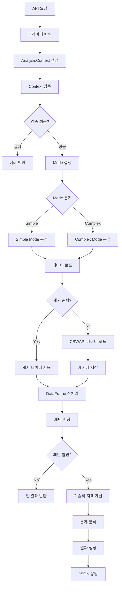
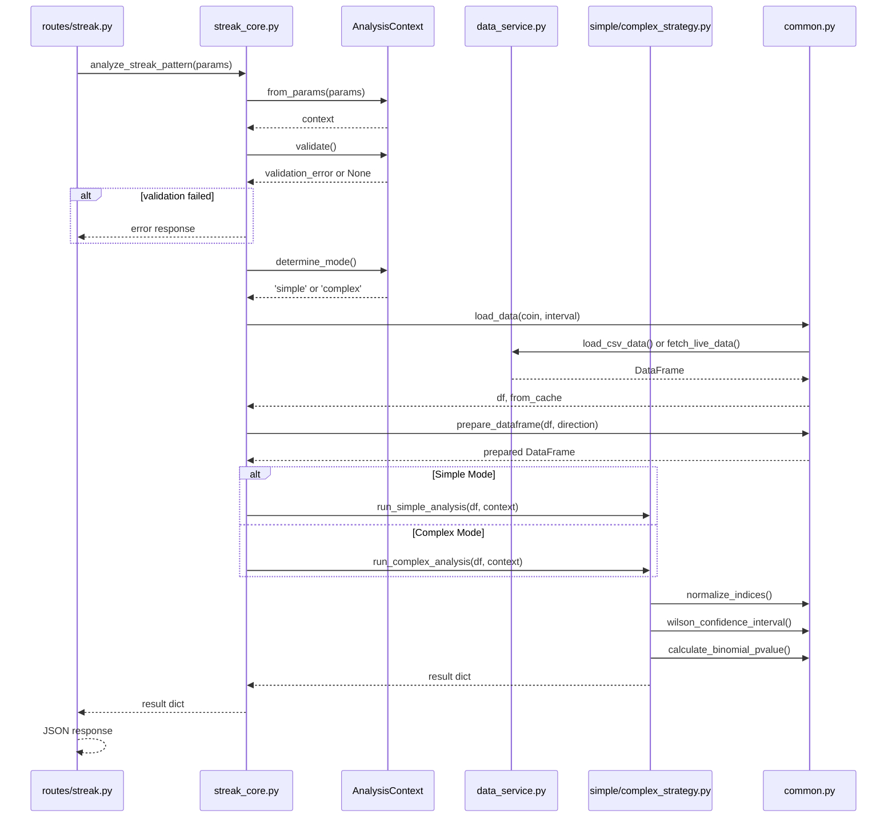

# 연속 봉 분석 (Streak Analysis) - 코드 구조 및 실행 순서

**버전**: 1.1.0  
**최종 수정**: 2025-01-17  
**상태**: C1 분석 일관성 버그 수정 완료

---

## 📊 전체 플로우차트



---

## 🔄 함수 호출 시퀀스



---

## 🎯 Simple Mode 패턴 매칭 플로우

```mermaid
flowchart TD
    A[DataFrame 입력] --> B[condition = True 초기화]
    B --> C{i = 1 to n}
    C --> D[condition &= target_bit.shift&#40;i&#41; == True]
    D --> C
    C -->|루프 종료| E[패턴 매칭 완료]
    E --> F[target_indices 추출]
    F --> G[normalize_indices 호출]
    G --> H{유효한 인덱스?}
    H -->|No| I[빈 결과 반환]
    H -->|Yes| J[중복 제거]
    J --> K[target_cases 생성]
    K --> L[C1 분석]
    L --> M{C1이 양봉?}
    M -->|Yes| N[continuation_count++]
    M -->|No| O[reversal_count++]
    N --> P[통계 계산]
    O --> P
    P --> Q[결과 반환]
```



---

## 🔗 코드 연결 구조

### 1. API 엔드포인트 (routes/streak.py)
```
@router.post('/api/streak-analysis')
  └─ api_streak_analysis(params: StreakAnalysisParams)
     └─ params.model_dump() → dict 변환
        └─ analyze_streak_pattern(params_dict) 호출
```

### 2. 컨트롤러 (strategy/streak_core.py)
```
analyze_streak_pattern(params: Dict)
  ├─ AnalysisContext.from_params(params) 생성
  ├─ context.validate() 검증
  ├─ context.determine_mode() → 'simple' 또는 'complex'
  ├─ load_data(coin, interval) → DataFrame 로드
  ├─ prepare_dataframe(df, direction) → 전처리
  └─ Mode 분기:
     ├─ simple → run_simple_analysis(df, context, from_cache)
     └─ complex → run_complex_analysis(df, context, from_cache)
```

### 3. 공통 유틸리티 (strategy/common.py)
- `AnalysisContext`: 분석 컨텍스트 (불변 객체)
- `load_data()`: 데이터 로드 (캐시 포함)
- `prepare_dataframe()`: DataFrame 전처리
- `normalize_indices()`: 인덱스 정규화
- `wilson_confidence_interval()`: 신뢰구간 계산
- `calculate_binomial_pvalue()`: p-value 계산

### 4. Simple Mode 전략 (strategy/simple_strategy.py)
```
run_simple_analysis(df, context, from_cache)
  ├─ 패턴 매칭
  ├─ 기술적 지표 계산
  ├─ 메인 통계 계산
  ├─ C2 예측
  ├─ 변동성 통계
  └─ 결과 반환
```

---

## 📋 상세 실행 순서 (Simple Mode 예시)

### Step 1: API 요청 수신
```
POST /api/streak-analysis
{
  "coin": "BTCUSDT",
  "interval": "4h",
  "n_streak": 3,
  "direction": "green"
}
```
↓
`routes/streak.py::api_streak_analysis()`

### Step 2: 파라미터 변환 및 컨트롤러 호출
```
params.model_dump() → dict 변환
analyze_streak_pattern(params_dict) 호출
```
↓
`strategy/streak_core.py::analyze_streak_pattern()`

### Step 3: Context 생성 및 검증
```
context = AnalysisContext.from_params(params)
  - coin: "BTCUSDT"
  - interval: "4h"
  - n_streak: 3
  - direction: "green"

validation_error = context.validate()
  - 복합 패턴인 경우 패턴 검증
  - 에러 있으면 즉시 반환
```
↓
`strategy/common.py::AnalysisContext`

### Step 4: Mode 결정
```
mode = context.determine_mode()
  - use_complex_pattern == True → "complex"
  - else → "simple"
```

### Step 5: 데이터 로드
```
df, from_cache = load_data(coin, interval)

1. 캐시 확인 (TTL 5분)
2. 캐시 없으면:
   - load_csv_data(coin, interval) 시도
   - 실패하면 fetch_live_data() 호출
3. 캐시에 저장
```
↓
`strategy/common.py::load_data()`
  └─ `data_service.py::load_csv_data()` 또는 `fetch_live_data()`

### Step 6: DataFrame 전처리
```
df = prepare_dataframe(df, direction)

추가 컬럼:
  - is_green = close > open
  - is_red = close < open
  - target_bit = is_green (direction='green')
  - body_pct = (close - open) / open * 100
```
↓
`strategy/common.py::prepare_dataframe()`

### Step 7: Simple Mode 분석 실행
```
run_simple_analysis(df, context, from_cache)
```
↓
`strategy/simple_strategy.py::run_simple_analysis()`

---

## 📊 Simple Mode 분석 상세 단계

### 7-1. 패턴 매칭
```python
n = 3  # 3연속 양봉

condition = True  # 초기화
for i in range(1, n+1):
    condition &= (df['target_bit'].shift(i) == True)

결과:
  - 봉 1: 양봉
  - 봉 2: 양봉
  - 봉 3: 양봉 ← 패턴 완성

target_indices = df[condition].index
valid_indices = normalize_indices(target_indices, df)
target_cases = df.loc[valid_indices]
```

### 7-2. 기술적 지표 계산
```python
df = _calculate_indicators(df)

계산 지표:
  - ATR (Average True Range)
  - RSI (Relative Strength Index)
  - Disparity (종가 / MA20 * 100)
  - vol_change (거래량 변화율)
```

### 7-3. 메인 통계 계산 (C1 분석) ✅ 버그 수정 완료

```python
target_cases의 다음 봉(C1) 확인

# ✅ 중요: C1 기준으로 계산 (T+1), 패턴 완성일(T)이 아님!
# direction == "green": C1이 양봉이면 continuation, 음봉이면 reversal
# direction == "red": C1이 음봉이면 continuation, 양봉이면 reversal

if direction == "green":
    continuation_count = C1이 양봉인 경우
    reversal_count = C1이 음봉인 경우
else:
    continuation_count = C1이 음봉인 경우
    reversal_count = C1이 양봉인 경우

continuation_rate = continuation_count / total * 100
reversal_rate = 100 - continuation_rate

continuation_ci = wilson_confidence_interval(...)
c1_pvalue = calculate_binomial_pvalue(...)

# avg_body_pct도 C1 봉 기준으로 계산
avg_body_pct = C1 continuations의 평균 body_pct
```

### 7-4. C2 예측 (조건부 확률)
```python
C1이 양봉인 경우:
  - C1의 다음 봉(C2)이 양봉일 확률 계산
  - c2_after_c1_green_rate

C1이 음봉인 경우:
  - C1의 다음 봉(C2)이 양봉일 확률 계산
  - c2_after_c1_red_rate
```

### 7-5. 변동성 통계
```python
max_dip = (open - low) / open * 100
max_rise = (high - open) / open * 100

dip_stats = trimmed_stats(max_dip)  # 최고/최저 1개 제외
rise_stats = trimmed_stats(max_rise)

z_score_dip = (current_dip - avg_dip) / std_dip
```

### 7-6. 추가 분석
- Comparative Report (nG + 1R 패턴 분석)
- Short Signal (과매수 시그널)
- RSI 구간별 분석
- Disparity 구간별 분석
- NY Trading Guide (시간대별 분석, 1d/3d만)

---

## 💡 핵심 데이터 흐름

1. API 요청 → `StreakAnalysisParams` (Pydantic 모델)
2. `params.model_dump()` → dict 변환
3. `analyze_streak_pattern(dict)` → 컨트롤러
4. `AnalysisContext` 생성 → 불변 컨텍스트 객체
5. `load_data()` → DataFrame (캐시 우선)
6. `prepare_dataframe()` → 전처리된 DataFrame
7. `run_simple_analysis()` → 분석 실행
8. 결과 딕셔너리 반환 → JSON 응답

---

## 🔑 주요 함수 호출 체인

```
api_streak_analysis()
  └─ analyze_streak_pattern()
     ├─ AnalysisContext.from_params()
     ├─ context.validate()
     ├─ context.determine_mode()
     ├─ load_data()
     │  └─ load_csv_data() 또는 fetch_live_data()
     ├─ prepare_dataframe()
     └─ run_simple_analysis() 또는 run_complex_analysis()
        ├─ _calculate_indicators()
        ├─ wilson_confidence_interval()
        ├─ calculate_binomial_pvalue()
        ├─ _calculate_comparative_report()
        ├─ _calculate_short_signal()
        └─ analyze_interval_statistics()
```

---

## 📝 핵심 개념

| 용어 | 설명 |
|------|------|
| **C1** | 패턴 완성 후 첫 번째 봉 (T+1) |
| **C2** | 패턴 완성 후 두 번째 봉 (T+2) |
| **continuation** | C1이 패턴 방향과 같은 경우 |
| **reversal** | C1이 패턴 방향과 반대인 경우 |
| **target_bit** | direction에 따라 is_green 또는 is_red |

### 예시 (3연속 양봉 분석):
```
봉 1: 양봉
봉 2: 양봉
봉 3: 양봉 ← 패턴 완성 (T)
봉 4: ??? ← C1 (T+1) - 분석 대상
봉 5: ??? ← C2 (T+2) - 조건부 분석
```

---

## 🔧 주요 파일 위치

- **API 엔드포인트**: `backend/routes/streak.py`
- **컨트롤러**: `backend/strategy/streak_core.py`
- **공통 유틸리티**: `backend/strategy/common.py`
- **Simple 전략**: `backend/strategy/simple_strategy.py`
- **Complex 전략**: `backend/strategy/complex_strategy.py`
- **데이터 서비스**: `backend/data_service.py`
- **요청 모델**: `backend/models/request.py`

---

## 📌 변경 이력

### v1.1.0 (2025-01-17)
- ✅ **C1 분석 일관성 버그 수정**: `simple_strategy.py`에서 continuation/reversal 계산 시 패턴 완성일(T) 대신 C1(T+1) 기준으로 정정
- 🎨 **Mermaid 다이어그램 추가**: 전체 플로우차트, 함수 호출 시퀀스, Simple Mode 패턴 매칭 플로우 추가
- 📝 **문서 버전 관리**: 버전 정보 및 변경 이력 섹션 추가

### v1.0.0 (2025-01-12)
- 초기 문서 작성
- Simple Mode 상세 설명 추가
- 코드 구조 및 실행 순서 문서화

---

## ⚠️ 알려진 제한사항

### EST 오프셋 동기화
- ✅ **해결됨**: `calculate_intraday_distribution` 함수는 `pytz`를 사용하여 DST 자동 처리
- `timezone_offset` 파라미터는 deprecated됨

### 메모리 캐시 한계
- ⚠️ **개선 필요**: `DataCache`는 TTL 기반(5분)이며 LRU 미구현
- 다량의 코인 데이터 로드 시 메모리 초과 가능성
- 권장 사항: LRU 알고리즘 도입 또는 최대 캐시 크기 제한

---

## 🔍 추가 참조 문서

- **Complex Mode 상세 문서**: [`COMPLEX_MODE_FLOW.md`](./COMPLEX_MODE_FLOW.md)
- **전체 아키텍처**: [`ARCHITECTURE.md`](./ARCHITECTURE.md)
- **프로젝트 개요**: [`README.md`](./README.md)
