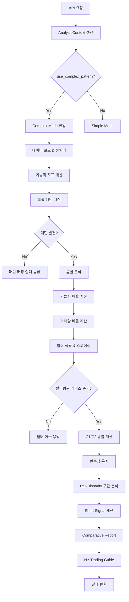
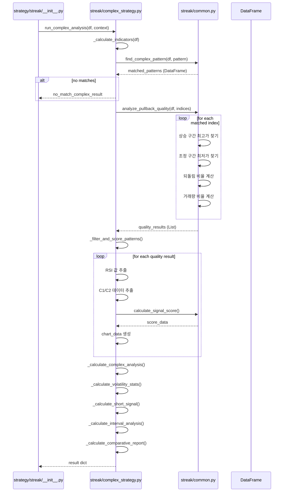
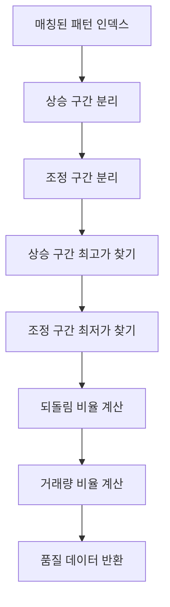
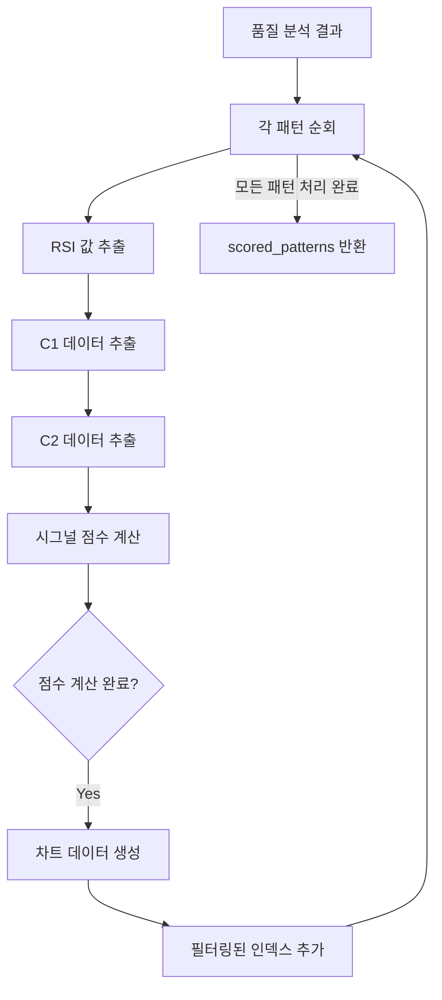

# Complex Mode 상세 문서 - 복합 패턴 분석 플로우

**버전**: 1.0.0  
**최종 수정**: 2025-01-17  
**상태**: 초기 작성

---

## 📊 Complex Mode 전체 플로우차트



---

## 🔄 Complex Mode 실행 시퀀스



---

## 📋 상세 실행 단계

### Step 1: 기술적 지표 계산

```python
df = _calculate_indicators(df)

계산 지표:
  - ATR (Average True Range)
    * tr = max(high-low, |high-prev_close|, |low-prev_close|)
    * atr_14 = tr.rolling(14).mean()
    * atr_pct = atr_14 / close * 100
  
  - RSI (Relative Strength Index)
    * delta = close.diff()
    * gain = delta.where(delta > 0, 0).rolling(14).mean()
    * loss = (-delta.where(delta < 0, 0)).rolling(14).mean()
    * rs = gain / loss
    * rsi = 100 - (100 / (1 + rs))
  
  - Disparity
    * ma20 = close.rolling(20).mean()
    * disparity = (close / ma20) * 100
  
  - Volume Change
    * vol_change = volume.pct_change() * 100
```

---

### Step 2: 복합 패턴 매칭

```mermaid
flowchart TD
    A[복합 패턴 입력] --> B[예: &#91;1, 1, -1, -1, 1&#93;]
    B --> C[패턴 길이 계산: n=5]
    C --> D[DataFrame 역순 스캔]
    D --> E{i번째 행부터 n개 확인}
    E --> F[각 봉의 방향 확인]
    F --> G{패턴 일치?}
    G -->|Yes| H[매칭 인덱스 기록]
    G -->|No| I[다음 행으로]
    H --> I
    I --> E
    E -->|스캔 완료| J[매칭된 인덱스 반환]
```



**패턴 매칭 로직** (`streak/common.py::find_complex_pattern`):

```python
복합 패턴: [1, 1, -1, -1, 1]
  1: 양봉
 -1: 음봉

예시:
  봉 1: 양봉 (1)
  봉 2: 양봉 (1)
  봉 3: 음봉 (-1)
  봉 4: 음봉 (-1)
  봉 5: 양봉 (1) ← 패턴 완성 (T)
  봉 6: ??? ← C1 (T+1) - 분석 대상

매칭 조건:
  - 모든 봉의 방향이 패턴과 일치
  - 패턴은 역순으로 스캔 (최신 봉부터)
  - 매칭된 인덱스는 패턴 완성 시점(T)
```

---

### Step 3: 품질 분석 (Pullback Quality)



**되돌림 비율 계산** (`streak/common.py::analyze_pullback_quality`):

```python
복합 패턴: [1, 1, -1, -1, 1] (2상승 2조정 1회복)
  - rise_len = 패턴에서 1의 개수 = 3
  - drop_len = 패턴에서 -1의 개수 = 2

상승 구간:
  - df.loc[pos - (rise_len + drop_len) : pos - drop_len - 1]
  - 최고가(rise_high) 찾기

조정 구간:
  - df.loc[pos - drop_len : pos - 1]
  - 최저가(drop_low) 찾기

되돌림 비율:
  retracement_pct = (rise_high - drop_low) / rise_high * 100

거래량 비율:
  - 조정 구간 평균 거래량 / 상승 구간 평균 거래량
  - vol_ratio = drop_vol_mean / rise_vol_mean
```

**예시**:

```
상승 구간 (봉 1-2):
  high: 100, 110
  rise_high = 110

조정 구간 (봉 3-4):
  low: 100, 95
  drop_low = 95

되돌림 비율:
  retracement_pct = (110 - 95) / 110 * 100 = 13.64%
```

---

### Step 4: 필터 적용 및 시그널 점수 계산



**시그널 점수 계산** (`streak/common.py::calculate_signal_score`):

```python
점수 구성 요소:
  1. 되돌림 비율 (retracement_pct)
     - 최적 범위: 20-40%
     - 점수: 40 (범위 내), 20 (범위 밖)
  
  2. 거래량 비율 (vol_ratio)
     - 최적 조건: < 0.8 (조정 구간 거래량 감소)
     - 점수: 30 (최적), 10 (비최적)
  
  3. RSI
     - 최적 범위: 45-65
     - 점수: 30 (범위 내), 10 (범위 밖)

총점:
  score = retracement_score + vol_ratio_score + rsi_score
  최대 점수: 100
  최소 점수: 40

신뢰도:
  - high: score >= 70
  - medium: 50 <= score < 70
  - low: score < 50
```

---

### Step 5: C1/C2 승률 계산

```python
C1 분석:
  - 패턴 완성(T) 다음 봉(C1)이 양봉인지 확인
  - c1_success_count = C1이 양봉인 경우
  - c1_total_count = 전체 C1 개수
  - c1_win_rate = c1_success_count / c1_total_count * 100
  - c1_win_rate_ci = wilson_confidence_interval(...)

C2 분석:
  - C1 다음 봉(C2)이 양봉인지 확인
  - c2_success_count = C2가 양봉인 경우
  - c2_total_count = 전체 C2 개수
  - c2_win_rate = c2_success_count / c2_total_count * 100
  - c2_win_rate_ci = wilson_confidence_interval(...)

평균 수익률:
  - avg_profit_c1 = C1의 평균 수익률 (%)
  - avg_profit_c2 = C2의 평균 수익률 (%)
```

---

### Step 6: 변동성 통계

```python
변동성 통계 (C1 기준):
  - max_dip = (open - low) / open * 100
  - max_rise = (high - open) / open * 100
  
  dip_stats = trimmed_stats(max_dip)
  rise_stats = trimmed_stats(max_rise)
  
  반환 값:
    - avg_dip: 평균 하락폭
    - avg_rise: 평균 상승폭
    - std_dip: 하락폭 표준편차
    - avg_atr_pct: 평균 ATR %
    - practical_max_dip: 실용적 최대 하락폭 (이상치 제거 후)
    - extreme_max_dip: 극단적 최대 하락폭 (이상치 포함)
```

---

### Step 7: Short Signal 계산

```python
조건:
  - 복합 패턴이 양봉으로 끝나는 경우 (pattern[-1] == 1)
  - RSI >= RSI_OVERBOUGHT (기본값: 70)

시뮬레이션:
  1. 과매수 케이스 필터링
  2. 진입가 설정: open * (1 + target_entry_rise / 100)
     * target_entry_rise = max(0.1, avg_rise * 0.6)
  3. 체결 확인: high >= entry_threshold
  4. 승률 계산: close < entry_threshold (숏 성공)

반환 조건:
  - 총 시그널 >= 3개
  - 체결률 >= 50%
  - 승률 >= 60%
```

---

### Step 8: RSI/Disparity 구간별 분석

```python
구간 정의:
  RSI_BINS = [0, 30, 45, 55, 70, 100]
  DISP_BINS = [0, 95, 98, 102, 105, float('inf')]

구간별 통계:
  - 각 구간별 C1 양봉 확률 계산
  - Wilson 신뢰구간 계산
  - Bonferroni 보정 적용 (다중 비교)

고확률 구간 식별:
  - p-value < 0.05 (Bonferroni 보정 후)
  - 신뢰구간 하한이 50% 이상
```

---

## 🔑 핵심 개념

### 패턴 표기법

| 값 | 의미 | 설명 |
|----|------|------|
| `1` | 양봉 | close > open |
| `-1` | 음봉 | close < open |

### 패턴 예시

```python
[1, 1, -1, 1]  # 양봉 2개 → 음봉 1개 → 양봉 1개
[1, 1, 1, -1, -1, 1]  # 양봉 3개 → 음봉 2개 → 양봉 1개
[-1, -1, 1, 1]  # 음봉 2개 → 양봉 2개
```

### 품질 지표

| 지표 | 최적 범위 | 의미 |
|------|-----------|------|
| **되돌림 비율** | 20-40% | 적절한 조정 깊이 |
| **거래량 비율** | < 0.8 | 조정 구간 거래량 감소 (건강한 조정) |
| **RSI** | 45-65 | 중립적 모멘텀 |

### C1/C2 분석

- **C1 (T+1)**: 패턴 완성 후 첫 번째 봉
- **C2 (T+2)**: 패턴 완성 후 두 번째 봉
- **성공**: C1 또는 C2가 양봉인 경우
- **실패**: C1 또는 C2가 음봉인 경우

---

## 📂 주요 함수 체인

```
run_complex_analysis()
  ├─ _calculate_indicators()
  │  ├─ ATR 계산
  │  ├─ RSI 계산
  │  └─ Disparity 계산
  │
  ├─ find_complex_pattern()
  │  └─ 복합 패턴 매칭
  │
  ├─ analyze_pullback_quality()
  │  ├─ 상승 구간 분석
  │  ├─ 조정 구간 분석
  │  ├─ 되돌림 비율 계산
  │  └─ 거래량 비율 계산
  │
  ├─ _filter_and_score_patterns()
  │  ├─ RSI 추출
  │  ├─ C1/C2 데이터 추출
  │  ├─ calculate_signal_score()
  │  └─ 차트 데이터 생성
  │
  └─ _calculate_complex_analysis()
     ├─ _calculate_volatility_stats()
     ├─ _calculate_short_signal()
     ├─ _calculate_interval_analysis()
     ├─ _calculate_comparative_report()
     └─ calculate_intraday_distribution()
```

---

## 🔧 주요 파일 위치

- **Complex 전략**: `backend/strategy/streak/complex_strategy.py`
- **공통 유틸리티**: `backend/strategy/streak/common.py`, `backend/strategy/streak/statistics.py`
- **API 엔드포인트**: `backend/modules/streak/router.py`
- **컨트롤러**: `backend/strategy/streak/__init__.py`

---

## 🎯 Complex Mode vs Simple Mode 비교

| 특징 | Simple Mode | Complex Mode |
|------|-------------|--------------|
| **패턴 입력** | N-연속 양/음봉 (n_streak) | 복합 패턴 배열 (complex_pattern) |
| **패턴 예시** | 3연속 양봉 | [1, 1, -1, 1] |
| **품질 분석** | ❌ | ✅ (되돌림, 거래량) |
| **시그널 점수** | ❌ | ✅ (0-100점) |
| **필터링** | 기본 통계만 | RSI, 되돌림 기반 필터 |
| **C1 분석** | ✅ | ✅ |
| **C2 분석** | ✅ (조건부) | ✅ |
| **차트 데이터** | ❌ | ✅ (상세 시각화용) |
| **사용 시나리오** | 단순 연속 패턴 | 복잡한 반복 패턴 |

---

## 💡 최적화 이력

### v1.0.0 (2025-01-12)
- ✅ `sum(1 for x in pattern if x == 1)` → `pattern.count(1)` (약 30% 성능 향상)
- ✅ C1/C2 통계 계산: 4개 루프 → 1개 루프 통합 (약 40% 성능 향상)
- ✅ `high_confidence_count`: 별도 루프 → list comprehension (가독성 및 성능 향상)

---

## ⚠️ 알려진 제한사항

### 1. 패턴 복잡도
- 패턴 길이가 긴 경우 (> 10개) 매칭 속도 저하
- 권장: 패턴 길이는 5-7개 이내로 제한

### 2. 메모리 사용
- 대량의 매칭 결과 (> 1000개) 시 메모리 사용량 증가
- 차트 데이터 생성 시 메모리 복사 발생

### 3. 필터 제거
- v1.0.0부터 `max_retracement` 필터 제거됨
- 모든 매칭 결과에 대해 점수 계산 후 사용자 판단에 맡김

---

## 🔍 추가 참조 문서

- **Simple Mode 상세 문서**: [`STREAK_ANALYSIS_FLOW.md`](./STREAK_ANALYSIS_FLOW.md)
- **전체 아키텍처**: [`ARCHITECTURE.md`](./ARCHITECTURE.md)
- **프로젝트 개요**: [`README.md`](./README.md)

---

## 📝 변경 이력

### v1.0.0 (2025-01-17)
- 🎉 초기 문서 작성
- 📊 Mermaid 다이어그램 추가 (플로우차트, 시퀀스 다이어그램)
- 📋 상세 실행 단계 문서화
- 🔑 핵심 개념 및 최적화 이력 추가
