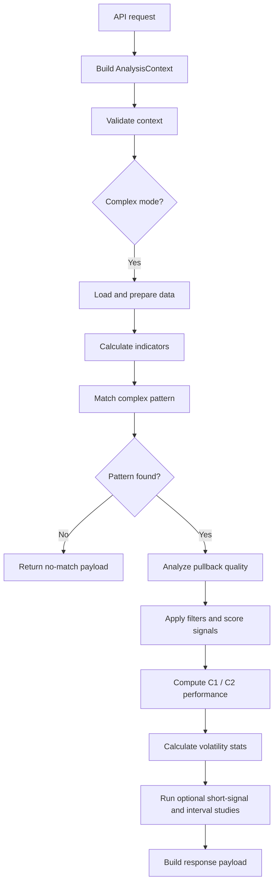

# Complex Mode Flow

**Version**: 1.0.0  
**Last Updated**: 2025-01-17  
**Status**: Initial public documentation

## Overview

Complex mode analyzes custom candle sequences such as `[1, 1, -1, 1]` rather than a plain `N`-candle streak. It extends the simple streak engine with pullback-quality analysis, signal scoring, short-signal logic, and richer chart-oriented outputs.

## High-Level Flow



## Execution Sequence

1. Request reaches `backend/modules/streak/router.py`.
2. `AnalysisContext` validates the complex pattern and determines the mode.
3. Shared data loaders return a normalized OHLCV DataFrame.
4. Complex-mode logic calculates indicators required for quality scoring.
5. Pattern-matching logic finds every matching sequence.
6. Pullback and volume quality are measured.
7. C1/C2 performance, volatility, and optional side analyses are computed.
8. The frontend receives a structured payload for tables, filters, and charting.

## Detailed Steps

### Step 1. Calculate technical indicators

Complex mode relies on indicator columns beyond the base OHLCV set. Typical fields include:

- ATR
- RSI
- disparity
- volume-derived helpers

### Step 2. Match the complex pattern

Pattern matching is handled through the shared streak utilities and checks that the ordered candle sequence matches the requested array.

Example input patterns:

```text
[1, 1, -1, 1]
[1, 1, 1, -1, -1, 1]
[-1, -1, 1, 1]
```

### Step 3. Analyze pullback quality

The quality step measures whether the matched sequence contains a healthy pullback rather than random noise.

Typical signals:

- retracement ratio
- pullback volume ratio
- momentum context

### Step 4. Apply filters and calculate signal scores

Signal scoring combines pattern quality and context indicators into a ranked output. The goal is not only to say that a pattern occurred, but also to estimate whether it happened in a stronger or weaker setup.

### Step 5. Calculate `C1` / `C2` outcomes

Complex mode keeps the same candle definitions as simple mode:

- `C1`: first candle after pattern completion (`T+1`)
- `C2`: second candle after pattern completion (`T+2`)

Computed outputs include:

- `c1_success_count`
- `c1_total_count`
- `c2_success_count`
- `c2_total_count`
- average profit or body metrics for `C1` and `C2`

### Step 6. Calculate volatility statistics

The module computes post-pattern drawdown and rise behavior, including practical and extreme downside metrics.

Typical outputs:

- average dip
- average rise
- dip standard deviation
- ATR percentage
- practical max dip
- extreme max dip

### Step 7. Run short-signal logic

Complex mode can also test short setups when the pattern ends in an overheated bullish configuration.

Typical checks:

1. filter overbought cases
2. define an entry threshold
3. test whether price reaches the entry zone
4. measure fill rate and short win rate

### Step 8. Run interval analysis

Interval studies bucket matched cases by derived indicators such as RSI or disparity and then compute:

- `C1` probability by bucket
- Wilson confidence intervals
- Bonferroni-adjusted significance flags

## Key Concepts

### Pattern notation

| Value | Meaning | Rule |
|---|---|---|
| `1` | Green candle | `close > open` |
| `-1` | Red candle | `close < open` |

### Quality metrics

| Metric | Preferred zone | Interpretation |
|---|---|---|
| Retracement ratio | 20-40% | Healthy pullback depth |
| Volume ratio | `< 0.8` | Lower pullback volume is healthier |
| RSI | 45-65 | Neutral-to-stable momentum context |

### `C1` and `C2`

- `C1 (T+1)`: first candle after pattern completion
- `C2 (T+2)`: second candle after pattern completion
- success is defined relative to the analysis rule being applied

## Key Function Chain

```text
run_complex_analysis()
  -> compute indicators
  -> find_complex_pattern()
  -> analyze_pullback_quality()
  -> calculate_signal_score()
  -> compute C1/C2 performance
  -> build chart and table outputs
```

## Important Files

- Complex strategy: `backend/strategy/streak/complex_strategy.py`
- Shared utilities: `backend/strategy/streak/common.py`, `backend/strategy/streak/statistics.py`
- API endpoint: `backend/modules/streak/router.py`
- Controller: `backend/strategy/streak/__init__.py`

## Complex Mode vs Simple Mode

| Capability | Simple Mode | Complex Mode |
|---|---|---|
| Input form | `n_streak` | `complex_pattern` array |
| Example | 3 green candles in a row | `[1, 1, -1, 1]` |
| Pullback-quality analysis | No | Yes |
| Signal scoring | No | Yes |
| Indicator-based filtering | Limited | Expanded |
| `C1` analysis | Yes | Yes |
| `C2` analysis | Yes | Yes |
| Chart-oriented payloads | Minimal | Richer |
| Best use case | Repeated simple streaks | Repeated structured sequences |

## Optimization History

### v1.0.0

- Replaced `sum(1 for x in pattern if x == 1)` with `pattern.count(1)`
- Consolidated multiple `C1` / `C2` loops into a single pass
- Replaced separate confidence-count loops with list-comprehension paths

## Known Constraints

### Pattern complexity

- Very long patterns can slow down matching
- practical recommendation: keep pattern length near 5-7 candles when possible

### Memory use

- large match sets can increase memory use
- chart payload generation involves extra copying and formatting

### Filter philosophy

- `max_retracement` was removed from hard filtering in favor of scoring and user interpretation

## Related Docs

- [`STREAK_ANALYSIS_FLOW.md`](./STREAK_ANALYSIS_FLOW.md)
- [`ARCHITECTURE.md`](../ARCHITECTURE.md)
- [`README.md`](../README.md)

## Change History

### v1.0.0 (2025-01-17)

- Initial document creation
- Added Mermaid-style flow documentation
- Added detailed execution stages, key concepts, and optimization notes
