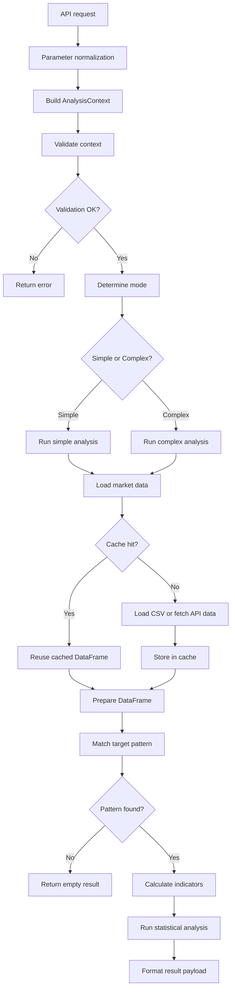

# Streak Analysis Flow

**Version**: 1.1.0  
**Last Updated**: 2025-01-17  
**Status**: C1 consistency fix applied

## Overview

This document explains the code structure and execution order of the streak-analysis flow. The most important invariant is that `C1` is the candle immediately after pattern completion (`T+1`), not the completion candle itself.

## End-to-End Flow



## Function Call Sequence

1. `backend/modules/streak/router.py` receives the request.
2. The router validates the payload and forwards it to the streak service.
3. `backend/strategy/streak/__init__.py::analyze_streak_pattern()` builds `AnalysisContext`.
4. The context validates parameters and determines whether the request runs in simple or complex mode.
5. Shared data loaders fetch CSV-backed or API-backed OHLCV data.
6. The selected strategy module runs analysis.
7. Statistical helpers compute confidence intervals, p-values, and derived summaries.
8. The result is serialized and returned to the frontend.

## Code Connectivity

### 1. API endpoint

- File: `backend/modules/streak/router.py`
- Role: request validation and service delegation

### 2. Controller/orchestrator

- File: `backend/strategy/streak/__init__.py`
- Role:
  - create `AnalysisContext`
  - validate inputs
  - determine simple vs complex mode
  - load and prepare data
  - delegate to `run_simple_analysis()` or `run_complex_analysis()`

### 3. Shared utilities

- `backend/strategy/context.py`: immutable analysis context
- `backend/strategy/streak/common.py`: data prep, cache helpers, index normalization, interval stats
- `backend/strategy/streak/statistics.py`: Wilson score, p-value, intraday distribution helpers

### 4. Simple strategy

- File: `backend/strategy/streak/simple_strategy.py`
- Role:
  - pattern matching
  - indicator enrichment
  - `C1` continuation/reversal analysis
  - conditional `C2` prediction
  - volatility and optional side analyses

## Simple Mode Walkthrough

### Step 1. Receive the API request

The request payload is parsed into a Pydantic model and converted into a normalized parameter dictionary.

### Step 2. Build and validate context

`AnalysisContext` ensures the request is internally consistent before data is loaded.

Validation covers:

- supported interval
- direction consistency
- complex-pattern constraints when relevant

### Step 3. Determine execution mode

- simple mode for plain `N`-streak analysis
- complex mode for custom pattern arrays

### Step 4. Load market data

Data loading follows this order:

1. check cache
2. load CSV if available
3. fall back to remote data fetch
4. save the normalized DataFrame back to cache

Primary path:

- `backend/utils/data_service.py`

### Step 5. Prepare the DataFrame

Preparation includes index normalization and derived columns used throughout the analysis pipeline.

Typical derived fields include:

- candle color flags
- body percentage
- range/ATR-related helpers
- indicator columns such as RSI and disparity

### Step 6. Match the streak pattern

For a request such as "3 green candles in a row", the strategy scans the prepared DataFrame, finds every completion point, and extracts the corresponding target cases.

### Step 7. Run statistical analysis

The simple strategy then computes:

- primary `C1` continuation vs reversal statistics
- conditional `C2` probabilities
- Wilson confidence intervals
- p-values
- volatility summaries

## Simple-Mode Detail

### Pattern matching

Pattern matching produces the completion points of the requested streak and normalizes them into valid target indexes.

### Indicator enrichment

The strategy computes or reuses indicator columns such as:

- RSI
- disparity
- volume change

### Primary `C1` statistics

This is the most important corrected rule in the module:

- `C1` means the first candle after pattern completion (`T+1`)
- for `direction == "green"`, a green `C1` is continuation and a red `C1` is reversal
- for `direction == "red"`, a red `C1` is continuation and a green `C1` is reversal

Average body metrics are also measured on the `C1` candle, not on the completion candle.

### `C2` prediction

Conditional probabilities are calculated for the next candle after `C1` (`T+2`), split by the observed `C1` outcome.

### Volatility statistics

The module summarizes dip/rise behavior and practical max-drawdown style metrics around the analyzed target cases.

### Optional add-on analyses

- comparative report such as `nG + 1R`
- short-signal simulation
- RSI interval analysis
- disparity interval analysis
- New York intraday distribution for supported higher intervals

## Core Data Flow

1. API request -> `StreakAnalysisParams`
2. Pydantic model -> normalized dict
3. `analyze_streak_pattern(dict)` -> orchestrator
4. `AnalysisContext` -> validated execution context
5. `load_data()` -> cached or freshly loaded DataFrame
6. `prepare_dataframe()` -> analysis-ready dataset
7. `run_simple_analysis()` -> statistical output
8. JSON response -> frontend rendering

## Key Function Chain

```text
router.py
  -> service.py
    -> analyze_streak_pattern()
      -> load_data()
        -> load_csv_data() or fetch_live_data()
      -> prepare_dataframe()
      -> run_simple_analysis() or run_complex_analysis()
```

## Key Terms

| Term | Meaning |
|---|---|
| `C1` | First candle after pattern completion (`T+1`) |
| `C2` | Second candle after pattern completion (`T+2`) |
| continuation | `C1` moves in the same direction as the pattern |
| reversal | `C1` moves against the pattern direction |
| `target_bit` | Color flag selected from direction (`is_green` or `is_red`) |

Example for a 3-green-candle streak:

```text
Candle 1: green
Candle 2: green
Candle 3: green  <- pattern completion (T)
Candle 4: ?      <- C1 (T+1), primary analysis target
Candle 5: ?      <- C2 (T+2), conditional follow-up target
```

## Important Files

- API endpoint: `backend/modules/streak/router.py`
- Controller: `backend/strategy/streak/__init__.py`
- Shared utilities: `backend/strategy/context.py`, `backend/strategy/streak/common.py`, `backend/strategy/streak/statistics.py`
- Simple strategy: `backend/strategy/streak/simple_strategy.py`
- Complex strategy: `backend/strategy/streak/complex_strategy.py`
- Data service: `backend/utils/data_service.py`
- Request models: `backend/models/request.py`

## Change History

### v1.1.0 (2025-01-17)

- Fixed the `C1` consistency bug so continuation/reversal is measured from `T+1`
- Added Mermaid diagrams for the high-level flow and call structure
- Added versioned documentation sections

### v1.0.0 (2025-01-12)

- Initial document creation
- Added the simple-mode step-by-step breakdown
- Documented the code structure and execution order

## Known Constraints

### New York timezone handling

- `calculate_intraday_distribution()` now uses `pytz` for automatic DST handling
- `timezone_offset` is effectively deprecated for this path

### Memory cache limits

- `DataCache` is TTL-based and does not yet implement LRU eviction
- loading many large coin datasets can still create memory pressure
- a future upgrade path is either LRU support or explicit cache-size limits

## Related Docs

- [`COMPLEX_MODE_FLOW.md`](./COMPLEX_MODE_FLOW.md)
- [`ARCHITECTURE.md`](../ARCHITECTURE.md)
- [`README.md`](../README.md)
